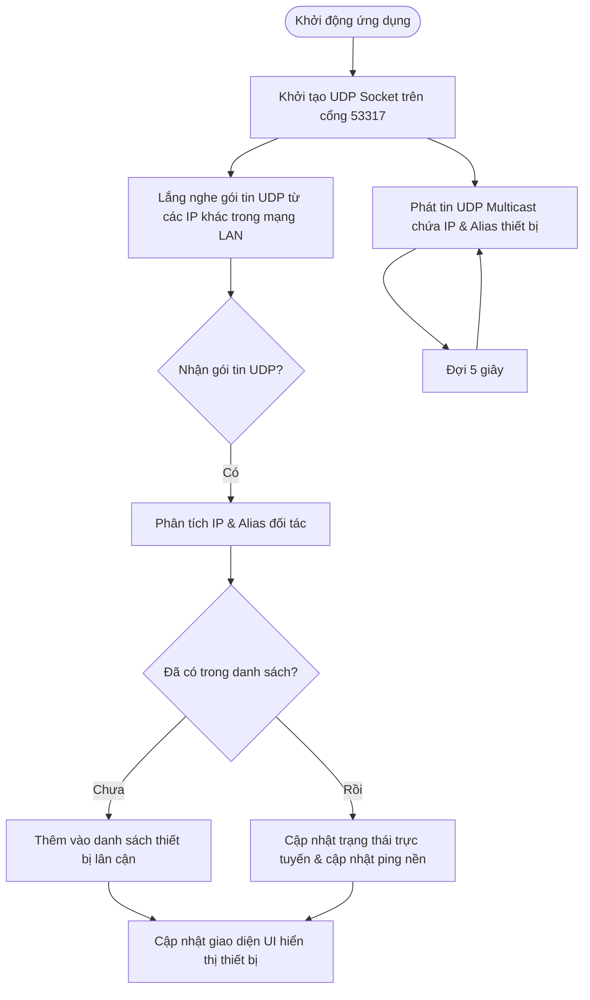
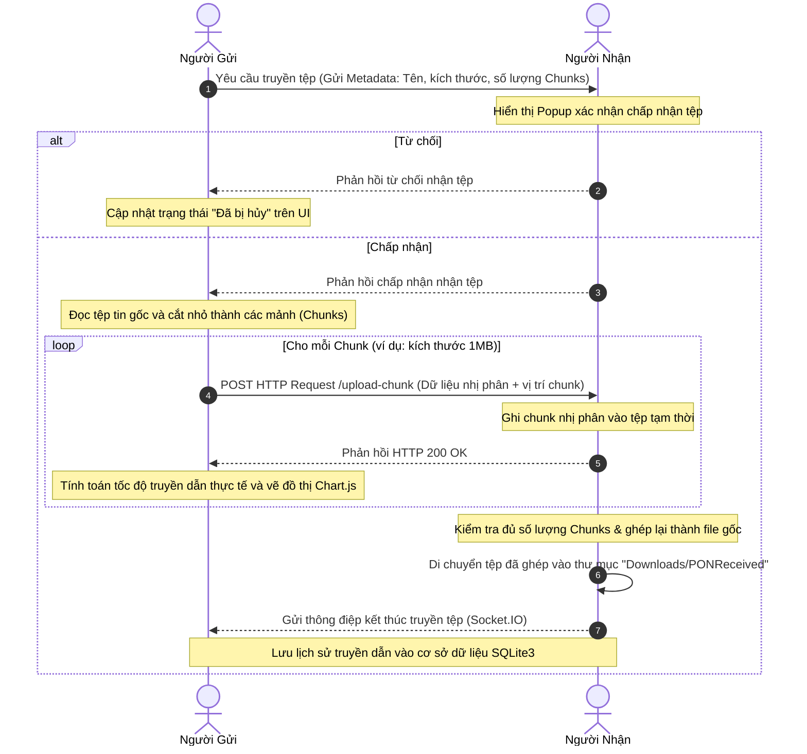
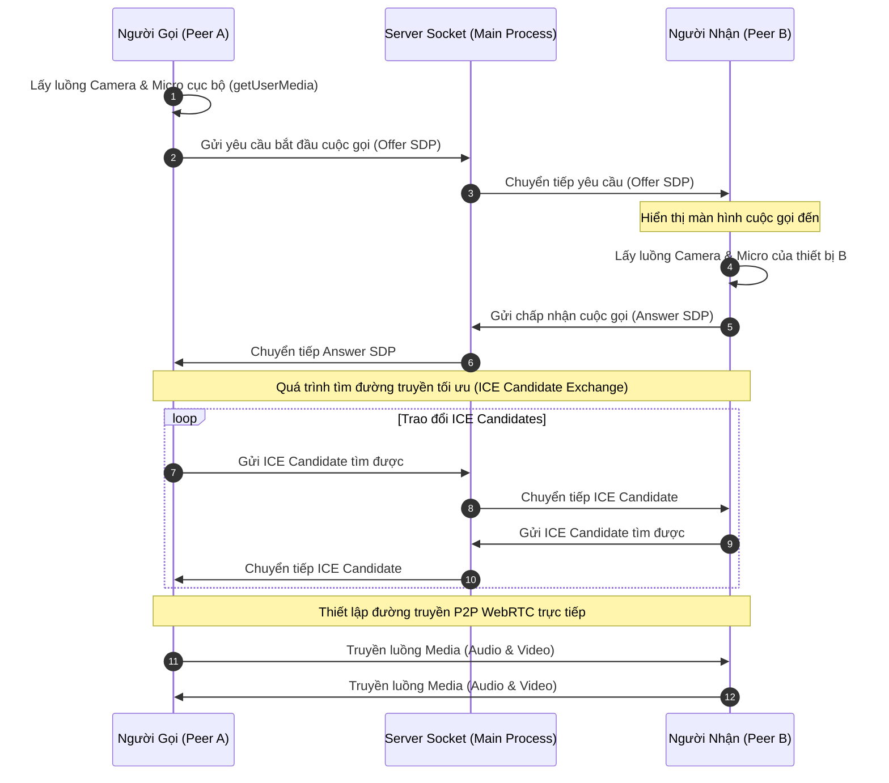
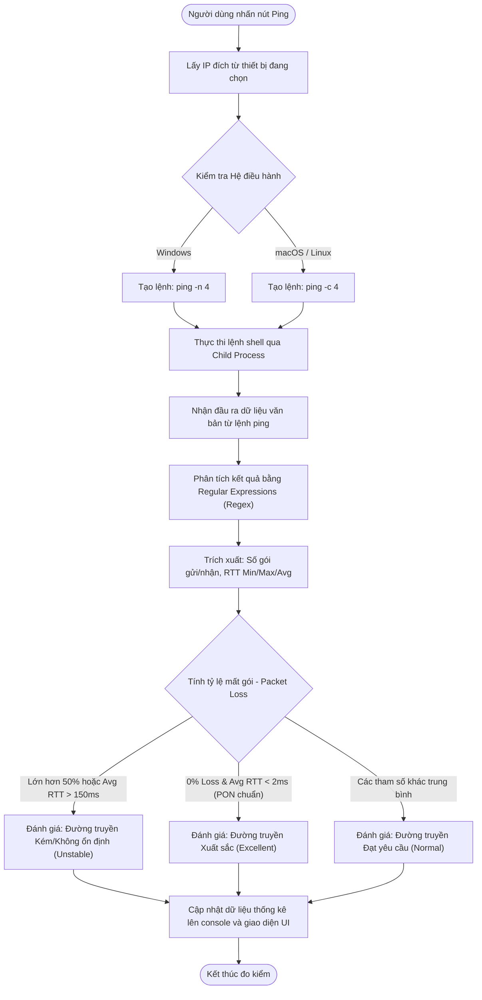

# HỆ THỐNG TRUYỀN DẪN QUANG PON - ỨNG DỤNG TRUYỀN DỮ LIỆU & GIAO TIẾP NỘI BỘ

Dự án này là một ứng dụng máy tính đa nền tảng (Desktop Application) được thiết kế và tối ưu hóa để trình diễn, truyền dẫn dữ liệu và giao tiếp nội bộ trong mạng LAN phục vụ đề tài nghiên cứu: **"THIẾT KẾ MÔ HÌNH HỆ THỐNG TRUYỀN DẪN QUANG PON ỨNG DỤNG TRONG PHÒNG THỰC HÀNH"**.

Ứng dụng đóng vai trò là lớp phần mềm kiểm thử đường truyền (Software Validation Layer), giúp đo đạc hiệu năng thực tế (băng thông, độ trễ, độ ổn định) khi truyền tải dữ liệu qua mô hình cáp quang và các bộ chia quang thụ động (Optical Splitter) của hệ thống PON.

---

## 🛠️ Công nghệ Sử dụng (Technology Stack)

Dự án sử dụng kiến trúc kết hợp giữa các thư viện hệ thống chạy trên nền Node.js và giao diện Web hiệu năng cao:

| Thành phần | Công nghệ / Thư viện | Vai trò trong hệ thống |
| :--- | :--- | :--- |
| **App Container** | Electron v42.3.2 | Đóng gói mã nguồn HTML/JS thành ứng dụng Desktop độc lập trên macOS, Windows và Linux. |
| **Backend** | Node.js | Xử lý các tác vụ mức thấp (quét cổng, bắt tay HTTP, đọc/ghi file phân đoạn, tương tác SQLite). |
| **Frontend UI** | HTML5, CSS3, Vanilla JavaScript | Thiết kế giao diện Glassmorphism trực quan, hỗ trợ chuyển đổi Light/Dark Theme mượt mà thông qua CSS Variables. |
| **Đồ thị** | Chart.js v4.4.9 | Biểu diễn telemetry tốc độ truyền dẫn dữ liệu thời gian thực dạng sóng (line chart). |
| **Cơ sở dữ liệu** | SQLite3 v5.1.7 | Lưu trữ lịch sử tin nhắn trò chuyện và nhật ký truyền tải tệp tin nội bộ (`lanlink.db`). |
| **Giao tiếp Mạng** | Socket.IO v4.7.5 | Kết nối kênh truyền thông điệp song song (duplex), chuyển phát tín hiệu (signaling) cuộc gọi. |
| **Quét thiết bị** | UDP Multicast | Phát sóng gói tin chứa IP và tên thiết bị lên dải mạng LAN để tự động phát hiện nhau. |
| **Đo kiểm (Ping)** | OS Ping Utility | Gọi tiến trình ping mặc định của hệ điều hành qua `child_process` để thu thập tham số RTT và gói tin hao hụt. |
| **Cuộc gọi** | WebRTC | Thiết lập luồng truyền phát âm thanh/hình ảnh P2P trực tiếp giữa hai trình duyệt/thiết bị mà không qua máy chủ. |

---

## 📂 Kiến trúc Ứng dụng & Cấu trúc Thư mục

```text
src/main.js
  ├── Tiến trình chính (Main Process - Node.js)
  ├── Khởi tạo HTTP Server (REST API) & Socket.IO Server
  ├── UDP Multicast: Tự động quét và phát sóng thiết bị
  ├── Vòng lặp ping nền kiểm tra trạng thái thiết bị lân cận
  ├── Giao tiếp SQLite3: Lưu trữ dữ liệu chat & lịch sử truyền tệp
  └── Child Process: Gọi lệnh ping của OS để đo độ trễ thủ công

src/preload.js
  └── Cầu nối IPC (Inter-Process Communication): Cung cấp API bảo mật từ Main Process cho Renderer Process

src/renderer/
  ├── index.html   : Cấu trúc giao diện Dashboard, các bảng điều khiển và popup
  ├── styles.css   : CSS variables, phong cách Glassmorphic và sơ đồ lưới (grid) hỗ trợ chuyển theme
  ├── renderer.js  : Tiến trình giao diện (Renderer Process) xử lý tương tác người dùng,
  │                  biểu diễn đồ thị Chart.js, nhận luồng WebRTC và điều khiển gọi
  ├── logo.png     : Logo phiên bản sáng (phù hợp Dark Mode)
  └── Logo_color.png: Logo phiên bản màu sắc gốc (phù hợp Light Mode)
```

---

## 📊 Lưu đồ Giải thuật (Flowcharts)

### 1. Giải thuật Phát hiện Thiết bị tự động (Device Discovery)
Hệ thống sử dụng cơ chế phát sóng UDP Multicast định kỳ để tự động nhận dạng các máy tính đang cài đặt và chạy LANLink trong cùng phân mạng.



---

### 2. Luồng Giải thuật Truyền tải Tệp Phân đoạn (Chunked File Transfer)
Để đảm bảo độ tin cậy và không gây tràn bộ nhớ khi gửi tệp tin dung lượng lớn qua kết nối cáp quang PON, ứng dụng thực hiện phân đoạn tệp thành các chunk dung lượng nhỏ và gửi qua HTTP Stream.



---

### 3. Luồng Kết nối Cuộc gọi Video (WebRTC Signaling)
Quá trình bắt tay kết nối P2P truyền hình ảnh và âm thanh trực tiếp giữa hai máy tính được thực hiện thông qua kênh trung gian Socket.IO (Signaling Channel).



---

### 4. Giải thuật Đo kiểm Độ trễ Mạng (Ping Diagnostics)
Để cung cấp công cụ kiểm thử chất lượng truyền dẫn cáp quang, giải thuật Ping sử dụng trực tiếp công cụ `ping` của hệ điều hành đích để tính toán thống kê chi tiết.



---

## ⚙️ Luồng Hoạt động Chi tiết & Chuyển đổi Giao diện (Theme Switcher Workflow)

Ứng dụng hỗ trợ chuyển đổi linh hoạt giữa giao diện sáng (Light Theme) và tối (Dark Theme) để phù hợp với các điều kiện ánh sáng khác nhau trong phòng thực hành:

1. **Khởi tạo và Mặc định:**
   - Khi khởi động, ứng dụng đọc trạng thái giao diện đã lưu từ `localStorage` với khóa `lanlink-theme`. Nếu chưa có, ứng dụng sẽ mặc định chạy **Light Theme** để đảm bảo hiển thị rõ ràng các thông số đo đạc quang học dưới ánh đèn phòng thí nghiệm.
   - Tiến trình chính (Main Process) cấu hình màu nền ban đầu của cửa sổ trình duyệt là `#f5f7fa` (xám sáng) để loại bỏ hoàn toàn hiện tượng nhấp nháy đen trước khi CSS được nạp đầy đủ.

2. **Cơ chế chuyển đổi (Runtime Toggle):**
   - Người dùng nhấp chọn biểu tượng Mặt trời/Mặt trăng trên Header.
   - Hàm `applyTheme(theme)` trong `renderer.js` cập nhật thuộc tính `data-theme` trên thẻ `<html>` gốc.
   - Toàn bộ giao diện cấu hình bằng các biến CSS variables (trong `styles.css`) tự động co giãn màu sắc theo lược đồ màu tương ứng.
   - Riêng Logo IUH ở góc trái sẽ được hoán đổi nguồn ảnh: hiển thị ảnh màu sắc gốc `Logo_color.png` trên nền sáng và ảnh trắng `logo.png` trên nền tối để tránh mất chi tiết chữ.

3. **Cập nhật Canvas Đồ thị:**
   - Vì Chart.js hoạt động trên thẻ `<canvas>` vẽ điểm ảnh nhị phân trực tiếp, các thông số màu sắc trục lưới (grid lines) và chỉ số số liệu (ticks color) không tự động nhận biến CSS.
   - Hàm `applyTheme` sẽ kiểm tra nếu cửa sổ Speed Chart đang hiển thị, nó sẽ hủy phiên bản biểu đồ hiện tại (`destroy()`) và khởi tạo lại biểu đồ mới với bộ cấu hình màu chữ/mạng lưới tương thích hoàn hảo với độ tương phản của nền giao diện mới.

---

## ⚡ Cơ chế Tối ưu hóa Đo kiểm & Hiển thị Tốc độ (Speed Measurements & UX Optimizations)

Để mô phỏng chính xác và trực quan hiệu năng của đường truyền quang PON trong phòng thực hành, ứng dụng đã được tối ưu hóa sâu ở lớp xử lý dữ liệu và trải nghiệm người dùng:

1. **Bộ lọc làm mượt tốc độ bằng thuật toán EMA (Exponential Moving Average):**
   - **Thách thức:** Lưu lượng mạng truyền qua socket thường bị biến động giật cục (bursty) do cơ chế xả bộ đệm (flush) của hệ điều hành, làm cho tốc độ thời gian thực (real-time speed) và thời gian hoàn thành dự kiến (ETA) nhảy lên xuống liên tục.
   - **Giải pháp:** Áp dụng thuật toán lọc EMA với hệ số $\alpha = 0.8$:
     $$\text{Tốc độ hiển thị} = (\text{Tốc độ đo được trước đó} \times 0.8) + (\text{Tốc độ tức thời mới} \times 0.2)$$
   - **Kết quả:** Đồ thị Chart.js và chỉ số thời gian hoàn thành (ETA) hiển thị mượt mà, phản ánh đúng xu hướng băng thông của đường truyền PON thực tế mà không bị nhiễu do xung đột bộ đệm.

2. **Tự động chuyển đổi tiêu điểm đồ thị (Auto-focus Chart Session):**
   - Khi một tiến trình gửi hoặc nhận tệp mới được bắt đầu, giao diện sẽ tự động chuyển tiêu điểm biểu đồ (`activeChartSessionId`) sang tệp mới đó và vẽ biểu đồ trực tuyến ngay lập tức. Người dùng không cần phải click thủ công vào thẻ tiến trình để theo dõi biểu đồ.

3. **Đồng bộ hóa thống kê cuối cùng (Telemetry Synchronization):**
   - Sau khi hoàn thành truyền tải, máy nhận (Receiver) tính toán tốc độ trung bình và tốc độ tối đa thực tế dựa trên tổng thời gian và dữ liệu đã nhận, sau đó trả ngược các tham số này về cho máy gửi (Sender) qua phản hồi HTTP. Điều này giúp thông số đo đạc quang học trên cả hai máy luôn khớp nhau 100% khi kết thúc.

---

## 📥 Hướng dẫn Cài đặt & Triển khai

### Yêu cầu hệ thống:
- Đã cài đặt **Node.js** (Khuyến nghị phiên bản LTS mới nhất - v20 hoặc v22).
- Máy tính có camera và micro (nếu muốn thử nghiệm cuộc gọi WebRTC).

### Các bước cài đặt:

1. **Tải mã nguồn và truy cập thư mục dự án:**
   ```bash
   cd LANLink
   ```

2. **Cài đặt các gói thư viện phụ thuộc (cần kết nối Internet):**
   ```bash
   npm install
   ```

3. **Rebuild module SQLite3 gốc (BẮT BUỘC):**
   Vì SQLite3 là một thư viện C/C++ gốc (native C++ addon), nó cần được biên dịch lại để tương thích chính xác với phiên bản Electron hiện tại và cấu trúc chip máy tính của bạn (đặc biệt quan trọng đối với máy macOS Apple Silicon M1/M2/M3 hoặc Windows x64):
   ```bash
   npx electron-builder install-app-deps
   ```
   *Sau bước này, ứng dụng có thể hoạt động hoàn toàn ngoại tuyến trong mạng LAN mà không cần Internet.*

---

## 🚀 Chạy và Đóng gói Ứng dụng

### 1. Khởi chạy chế độ phát triển (Development):
```bash
npm start
# hoặc
npm run dev
```

### 2. Đóng gói ứng dụng thành file cài đặt (Production Build):
Dự án được tích hợp sẵn file script đóng gói tự động `build.sh` cho hệ điều hành macOS.
Để thực hiện đóng gói:
```bash
chmod +x build.sh
./build.sh
```
Sau khi hoàn tất, thư mục `dist/` sẽ chứa các tệp đóng gói:
- **macOS:** File `.dmg` hoặc `.zip` cho cả hai kiến trúc Intel (`x64`) và Apple Silicon (`arm64`).
- **Windows:** File cài đặt NSIS `.exe` (`Setup 1.0.0.exe` kiến trúc `x64`).

---

## 💻 Hướng dẫn Thử nghiệm Thực tế (Demo Guide)

Để thực hiện báo cáo khóa luận/đồ án đạt kết quả trực quan nhất, chuẩn bị hai máy tính kết nối cùng một mạng LAN (hoặc kết nối qua cùng một điểm phát Wi-Fi):

1. **Khởi chạy ứng dụng:** Mở ứng dụng trên cả máy tính A và máy tính B.
2. **Chọn giao diện mạng (Network Interface):** Ở thanh bên trái, nếu máy tính của bạn có nhiều card mạng (Wi-Fi, Ethernet, Loopback), hãy click chọn đúng IP thuộc dải mạng LAN đang kết nối.
3. **Kết nối thiết bị:** 
   - Nhập IP LAN của máy tính B vào mục **"Kết nối IP thủ công"** trên máy tính A (ví dụ: `192.168.1.76`) rồi bấm nút `+`.
   - Thiết bị B sẽ xuất hiện trực tuyến tại danh sách **"Thiết bị lân cận"** trên màn hình máy A và tự động được chọn làm đích.
4. **Đo kiểm mạng (Ping Diagnostics):**
   - Chọn thiết bị đối tác, click nút **"Đo tốc độ (Ping)"**.
   - Hộp thoại đo kiểm sẽ xuất hiện, gửi tuần tự **4 gói tin** ping tới thiết bị đích và hiển thị kết quả trực tiếp lên dòng console.
   - Khi hoàn tất, hệ thống sẽ đưa ra thống kê: Số gói tin gửi/nhận/mất, RTT (Min/Max/Avg) và đánh giá chất lượng đường truyền (Excellent/Normal/Unstable).
5. **Truyền tệp & Nhắn tin:**
   - Qua tab **"Gửi văn bản"** để trò chuyện thời gian thực.
   - Qua tab **"Gửi tệp"**, chọn một file bất kỳ (dung lượng tùy ý) và nhấn **"Truyền dữ liệu"**. Theo dõi tốc độ truyền tải Mbps tăng dần và biểu đồ Chart.js cập nhật trực quan ở cột bên phải.
   - Các tệp tin nhận được sẽ được lưu tự động vào thư mục mặc định: `Downloads/PONReceived/`.
6. **Cuộc gọi thoại/video:**
   - Click nút **"Gọi thiết bị"** để bắt đầu cuộc gọi WebRTC P2P. Phía đối tác sẽ nhận được hộp thoại chấp nhận/từ chối cuộc gọi.

---

## ⚠️ Khắc phục Sự cố Tường lửa & Mạng LAN

- **Tường lửa (Firewall):** Khi chạy ứng dụng lần đầu tiên, hãy cấp quyền cho phép Node.js/Electron giao tiếp qua mạng **Private** (Hồ sơ mạng của Windows phải được đặt là Private/Home, không để Public).
- **Phân mạng (Subnet):** Đảm bảo cả hai máy tính nằm trong cùng một phân mạng con (ví dụ: cùng có IP bắt đầu bằng `192.168.1.x`).
- **VPN:** Tắt toàn bộ phần mềm VPN (như NordVPN, 1.1.1.1, OpenVPN) trước khi chạy vì VPN sẽ định tuyến lại dữ liệu mạng LAN và chặn các luồng phát hiện UDP Multicast.
- **Quyền truy cập Camera/Micro:** Trên macOS, hãy đảm bảo ứng dụng Terminal (hoặc ứng dụng đóng gói) đã được cấp quyền truy cập Camera và Microphone trong phần cài đặt bảo mật hệ thống (Security & Privacy).
- **Cổng kết nối:** Đảm bảo cổng TCP `53317` không bị chặn hoặc chiếm dụng bởi các dịch vụ khác.
